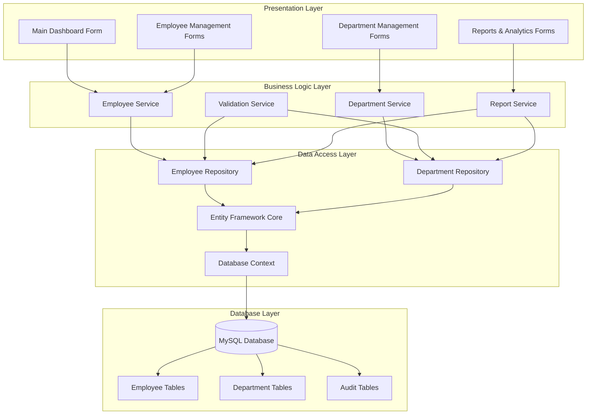
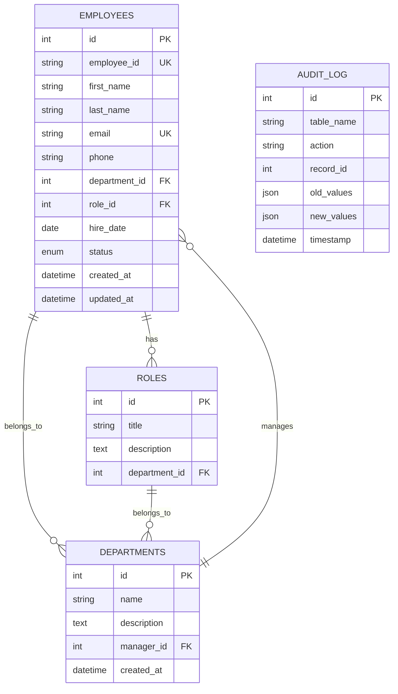
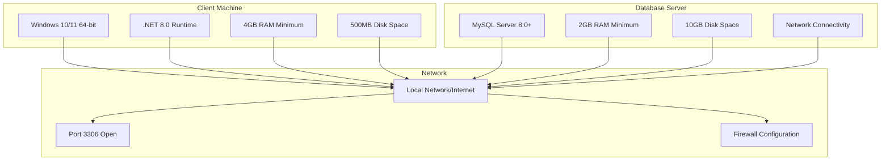
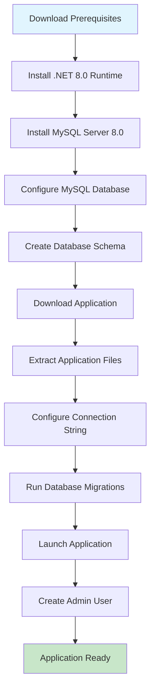
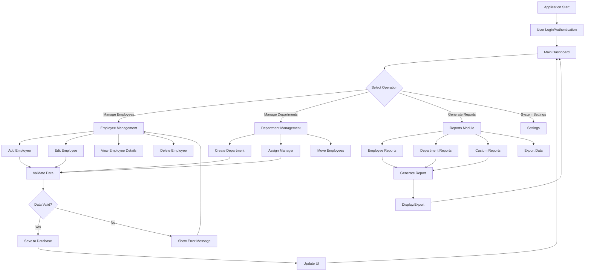
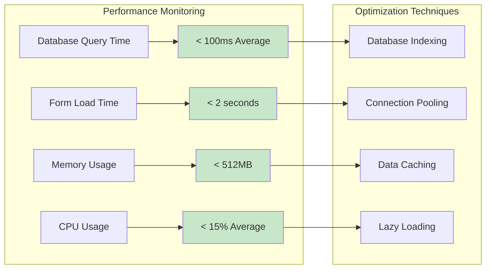
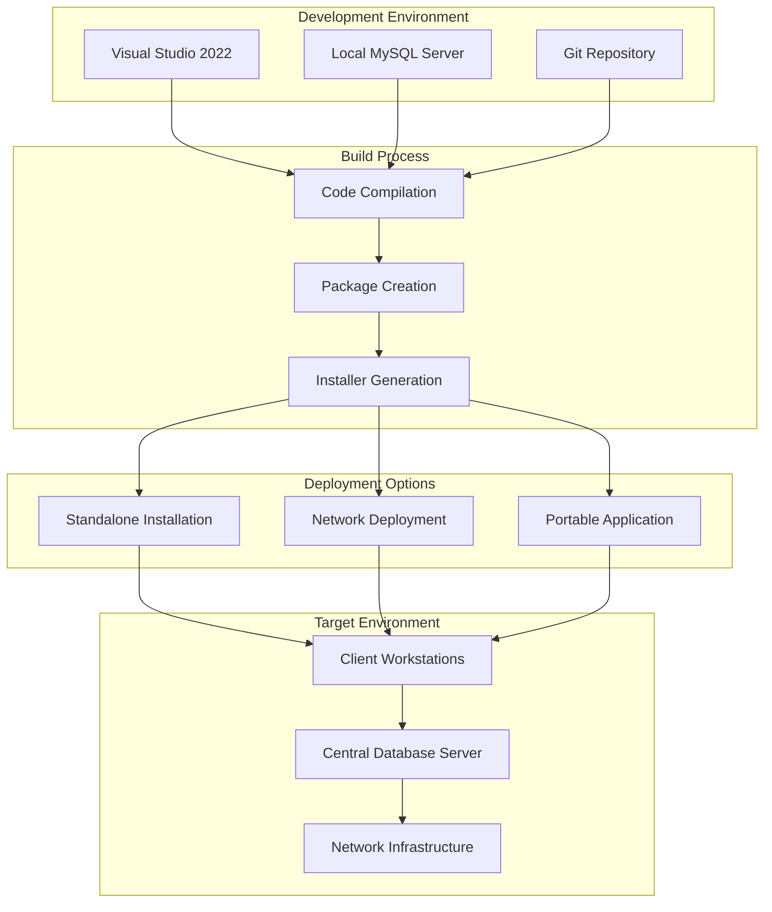
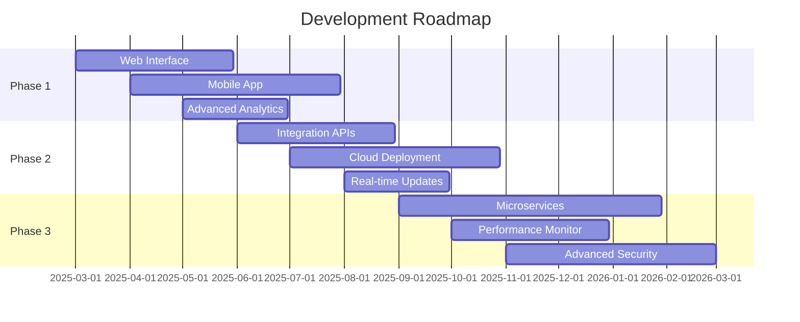
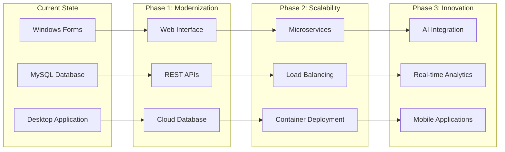

# Employee Management System

[](LICENSE)
[](https://dotnet.microsoft.com/)
[](https://mysql.com/)
[](https://github.com/yourusername/employee-management)

> **A comprehensive desktop application for efficient employee data management**

## Overview

The Employee Management System is a robust desktop application built with C# Windows Forms and MySQL database, designed to streamline human resource operations for small to medium-sized organizations. This solution provides an intuitive interface for managing employee records, departmental structures, and organizational hierarchies.

## Core Features

### Employee Management
- **Complete Employee Profiles**: Store comprehensive employee information including personal details, contact information, and employment history
- **Advanced Search & Filter**: Quickly locate employees using multiple search criteria
- **Bulk Operations**: Efficiently manage multiple employee records simultaneously
- **Data Validation**: Ensure data integrity with built-in validation rules

### Department & Role Management
- **Department Structure**: Organize employees into logical departmental units
- **Role Assignment**: Define and assign roles with specific responsibilities
- **Hierarchy Management**: Maintain organizational structure and reporting relationships
- **Status Tracking**: Monitor employee status (Active, Inactive, On Leave)

### Data Management
- **Secure Database**: MySQL backend ensuring data reliability and security
- **Backup & Recovery**: Built-in database backup and restoration capabilities
- **Data Export**: Export employee data to various formats (CSV, PDF, Excel)
- **Audit Trail**: Track all data modifications for compliance and security

## Technical Architecture

### System Architecture Diagram


### Application Structure
```
Employee Management System
├── Presentation Layer (Windows Forms)
│   ├── Main Dashboard
│   ├── Employee Forms
│   ├── Department Management
│   └── Reports & Analytics
├── Business Logic Layer
│   ├── Employee Services
│   ├── Department Services
│   ├── Validation Logic
│   └── Report Generation
├── Data Access Layer
│   ├── Database Connection
│   ├── Employee Repository
│   ├── Department Repository
│   └── Query Handlers
└── Database Layer (MySQL)
    ├── Employee Tables
    ├── Department Tables
    ├── Relationship Tables
    └── Audit Tables
```

### Database Schema


```sql
-- Core database structure
CREATE TABLE employees (
    id INT PRIMARY KEY AUTO_INCREMENT,
    employee_id VARCHAR(50) UNIQUE NOT NULL,
    first_name VARCHAR(100) NOT NULL,
    last_name VARCHAR(100) NOT NULL,
    email VARCHAR(255) UNIQUE,
    phone VARCHAR(20),
    department_id INT,
    role_id INT,
    hire_date DATE,
    status ENUM('Active', 'Inactive', 'On Leave'),
    created_at TIMESTAMP DEFAULT CURRENT_TIMESTAMP,
    updated_at TIMESTAMP DEFAULT CURRENT_TIMESTAMP ON UPDATE CURRENT_TIMESTAMP,
    FOREIGN KEY (department_id) REFERENCES departments(id),
    FOREIGN KEY (role_id) REFERENCES roles(id)
);

CREATE TABLE departments (
    id INT PRIMARY KEY AUTO_INCREMENT,
    name VARCHAR(100) NOT NULL,
    description TEXT,
    manager_id INT,
    created_at TIMESTAMP DEFAULT CURRENT_TIMESTAMP
);

CREATE TABLE roles (
    id INT PRIMARY KEY AUTO_INCREMENT,
    title VARCHAR(100) NOT NULL,
    description TEXT,
    department_id INT,
    FOREIGN KEY (department_id) REFERENCES departments(id)
);
```

### Entity Relationship Diagram


## Technology Stack

### Development Platform
- **Framework**: .NET 8.0 (C#)
- **UI Framework**: Windows Forms
- **Database**: MySQL 8.0
- **ORM**: Entity Framework Core
- **Reporting**: Crystal Reports / ReportViewer

### Development Tools
- **IDE**: Visual Studio 2022
- **Database Management**: MySQL Workbench
- **Version Control**: Git
- **Package Manager**: NuGet

### Third-Party Libraries
```xml
<!-- Key NuGet packages -->
<PackageReference Include="MySql.EntityFrameworkCore" Version="8.0.0" />
<PackageReference Include="Microsoft.EntityFrameworkCore" Version="8.0.0" />
<PackageReference Include="Microsoft.EntityFrameworkCore.Tools" Version="8.0.0" />
<PackageReference Include="ClosedXML" Version="0.102.0" />
<PackageReference Include="iTextSharp" Version="5.5.13" />
```

## Installation & Setup

### System Requirements Diagram


### Installation Process Flow


### Prerequisites
```
System Requirements:
- Windows 10/11 (64-bit)
- .NET 8.0 Runtime
- MySQL Server 8.0 or later
- Minimum 4GB RAM
- 500MB available disk space
```

### Installation Steps

1. **Download and Install Prerequisites**
   ```bash
   # Install .NET 8.0 Runtime
   # Download from: https://dotnet.microsoft.com/download/dotnet/8.0
   
   # Install MySQL Server 8.0
   # Download from: https://dev.mysql.com/downloads/mysql/
   ```

2. **Database Setup**
   ```sql
   -- Create database
   CREATE DATABASE employee_management;
   
   -- Create user (optional)
   CREATE USER 'emp_user'@'localhost' IDENTIFIED BY 'your_password';
   GRANT ALL PRIVILEGES ON employee_management.* TO 'emp_user'@'localhost';
   FLUSH PRIVILEGES;
   ```

3. **Application Configuration**
   ```xml
   <!-- Update app.config with your database connection -->
   <connectionStrings>
     <add name="DefaultConnection" 
          connectionString="Server=localhost;Database=employee_management;Uid=emp_user;Pwd=your_password;" 
          providerName="MySql.Data.MySqlClient" />
   </connectionStrings>
   ```

4. **Build and Run**
   ```bash
   # Clone the repository
   git clone https://github.com/yourusername/employee-management.git
   
   # Navigate to project directory
   cd employee-management
   
   # Restore NuGet packages
   dotnet restore
   
   # Build the application
   dotnet build
   
   # Run the application
   dotnet run
   ```

## Application Features

### User Interface Screenshots

#### Main Dashboard

*Central hub displaying employee statistics, recent activities, and quick access to key functions*

#### Employee Management Interface

*Comprehensive employee data entry and editing interface with validation*

#### Department Management

*Organizational structure management with drag-and-drop functionality*

#### Reports and Analytics

*Advanced reporting interface with customizable filters and export options*

### Application Workflow



### Main Dashboard
- **Employee Overview**: Quick statistics and recent activities
- **Department Summary**: Departmental employee counts and status
- **Quick Actions**: Rapid access to common operations
- **Search Interface**: Global search functionality

### Employee Management Forms
- **Add Employee**: Comprehensive employee registration form
- **Edit Employee**: Modify existing employee information
- **Employee Details**: Detailed view of employee records
- **Bulk Import**: Import employees from CSV/Excel files

### Reporting Capabilities
- **Employee Reports**: Detailed employee listings and summaries
- **Department Reports**: Departmental analysis and statistics
- **Custom Reports**: Configurable reports based on specific criteria
- **Export Options**: PDF, Excel, and CSV export formats

## Security Features

### Data Protection
- **Input Validation**: Comprehensive validation to prevent SQL injection
- **Data Encryption**: Sensitive data encryption at rest
- **Access Control**: Role-based access to application features
- **Audit Logging**: Complete audit trail of all system activities

### Database Security
- **Parameterized Queries**: Protection against SQL injection attacks
- **Connection Security**: Encrypted database connections
- **Backup Encryption**: Encrypted database backups
- **User Authentication**: Database user authentication and authorization

## Performance Optimization

### Application Performance Metrics

*Real-time performance monitoring showing response times and resource usage*

### System Performance Flow


### Application Performance
- **Efficient Queries**: Optimized database queries with proper indexing
- **Data Caching**: Strategic caching for frequently accessed data
- **Lazy Loading**: Efficient data loading strategies
- **Memory Management**: Proper disposal of resources and connections

### Database Optimization
```sql
-- Key database indexes for performance
CREATE INDEX idx_employee_department ON employees(department_id);
CREATE INDEX idx_employee_status ON employees(status);
CREATE INDEX idx_employee_hire_date ON employees(hire_date);
CREATE INDEX idx_employee_name ON employees(last_name, first_name);
```

## Deployment

### Deployment Architecture


### Deployment Options Comparison

*Comparison of different deployment strategies with their pros and cons*

### Standalone Deployment
```bash
# Create self-contained deployment
dotnet publish -c Release -r win-x64 --self-contained true

# Create installer using tools like:
# - Inno Setup
# - WiX Toolset
# - Visual Studio Installer Projects
```

### Network Deployment
- **Shared Database**: Multiple clients connecting to central MySQL server
- **Application Updates**: Centralized update mechanism
- **Configuration Management**: Centralized configuration for multiple clients

## Troubleshooting

### Common Issues
1. **Database Connection Issues**
   - Verify MySQL service is running
   - Check connection string configuration
   - Ensure firewall allows MySQL connections

2. **Performance Issues**
   - Review database indexes
   - Check for large dataset queries
   - Monitor memory usage

3. **Data Import Problems**
   - Verify file format compatibility
   - Check for data validation errors
   - Ensure proper column mappings

## Future Enhancements

### Development Roadmap


### Feature Evolution Timeline

*Visual representation of planned features and their implementation timeline*

### Technology Migration Path


### Planned Features
- **Web Interface**: Browser-based access for remote users
- **Mobile App**: Mobile application for basic operations
- **Advanced Analytics**: Enhanced reporting and analytics capabilities
- **Integration APIs**: REST API for third-party integrations
- **Cloud Deployment**: Cloud-based deployment options

### Technical Improvements
- **Microservices Architecture**: Transition to microservices for scalability
- **Real-time Updates**: WebSocket-based real-time notifications
- **Advanced Security**: Multi-factor authentication and encryption
- **Performance Monitoring**: Application performance monitoring and analytics

## Contributing

We welcome contributions to improve the Employee Management System. Please follow these guidelines:

1. **Code Standards**: Follow C# coding conventions and best practices
2. **Testing**: Include unit tests for new features
3. **Documentation**: Update documentation for any changes
4. **Pull Requests**: Submit pull requests with clear descriptions

## Support

### Documentation
- **User Manual**: Comprehensive user guide and tutorials
- **API Documentation**: Technical documentation for developers
- **FAQ**: Frequently asked questions and solutions

### Getting Help
- **Issues**: Report bugs and request features on GitHub
- **Email Support**: Contact support at [kamranahmed7602@gmail.com](mailto:kamranahmed7602@gmail.com)
- **Community Forum**: Join our community discussions

## License

This project is licensed under the MIT License - see the [LICENSE](LICENSE) file for details.

## Development Team

**Kamran Ahmed**  
*BS Artificial Intelligence | Air University*  
[](https://linkedin.com/in/kamran-ahmed) [](https://github.com/kamran-ahmed)

**Air University - Artificial Intelligence Department**  
*Advancing practical software solutions through academic excellence*

---

*A professional desktop application solution developed with modern C# and MySQL technologies*
